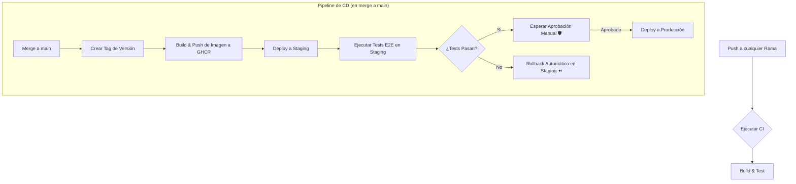
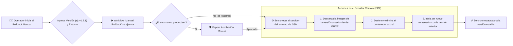

# Solución al Challenge Sr. Developer CI/CD

Este repositorio contiene la solución completa para el challenge de Sr. Developer CI/CD. El objetivo principal fue diseñar e implementar un pipeline de CI/CD robusto y de principio a fin para una aplicación mínima de Node.js.

---
## 1. Análisis y Refactorización Inicial

El proyecto inicial requirió algunas mejoras clave para establecer una base limpia y escalable.

### Estructura y Limpieza del Código
- **Eliminación de Archivos Duplicados:** El estado inicial tenía un `server.js` y un directorio `__tests__` duplicados en la raíz. Estos fueron eliminados para centralizar la lógica de la aplicación dentro de la carpeta `/backend`.
- **Separación de Responsabilidades:** La aplicación fue refactorizada para separar responsabilidades, mejorando la mantenibilidad y la capacidad de testeo:
  - `handlers/`: Contiene funciones responsables de manejar las peticiones y respuestas HTTP.
  - `validators/`: Contiene funciones de lógica de negocio pura, completamente desacopladas del servidor web.

---
## 2. Nueva Funcionalidad: Validador de CUIT

Para crear un escenario de testing más realista, se añadió una nueva funcionalidad relevante para el negocio:
- **Endpoint:** `POST /cuit/validate`
- **Funcionalidad:** Valida un CUIT argentino basándose en su algoritmo de suma de verificación (checksum).
- **Request Body:** `{ "cuit": "20111111112" }`
- **Respuesta:** `{ "isValid": true, "cuit": "20111111112" }` o un `400 Bad Request` para formatos inválidos.

---
## 3. Estrategia de Testing

Se implementó una estrategia de testing de múltiples capas para asegurar la calidad y fiabilidad del código.

- **Tests Unitarios:** Prueban piezas individuales de lógica pura de forma aislada. El algoritmo de validación de CUIT en `validators/cuit.js` se testea de esta manera en `__tests__/cuit.logic.test.js`, asegurando que la lógica de negocio principal es correcta.
- **Tests de Integración:** Verifican que las diferentes partes de la aplicación funcionan juntas correctamente. El archivo `__tests__/app.test.js` utiliza `supertest` para realizar peticiones HTTP reales a los endpoints de la aplicación (`/health` y `/cuit/validate`) y afirmar que las respuestas (códigos de estado, cuerpos JSON) son correctas.

---
## 4. Dockerización

La aplicación está completamente containerizada usando Docker para asegurar un entorno de ejecución consistente y portable.

- **`Dockerfile`:** El Dockerfile está optimizado para producción, incluyendo:
  - Un enfoque de múltiples etapas para aprovechar el caché de Docker.
  - Una imagen base ligera y segura (`node:18-alpine`).
  - Instalación de dependencias solo de producción (`npm ci --omit=dev`).
  - Ejecución como un usuario no-root (`USER node`) como una práctica de seguridad crítica.
- **`docker-compose.yml`:** Se provee un archivo de Docker Compose para una experiencia de desarrollo local fluida. Reconstruye automáticamente la imagen ante cambios y utiliza una estrategia de volúmenes inteligente para sincronizar el código local mientras protege la carpeta `node_modules` del contenedor.

---
## 5. Pipeline de CI/CD

Se construyó un pipeline de CI/CD completo usando GitHub Actions (`.github/workflows/main.yml`). Automatiza todo el proceso desde el testing hasta el despliegue en producción.

### Diagrama de Flujo del Pipeline


### Detalle de los Jobs
- **`build-and-test` (CI):** Se dispara en cada `push` a cualquier rama. Instala dependencias y ejecuta todos los tests.
- **`prepare`:** En un merge a `main`, calcula variables compartidas para los jobs posteriores.
- **`build-and-push-image`:** Construye la imagen de Docker y la publica en GitHub Container Registry (GHCR) con una etiqueta inmutable (el SHA del commit).
- **`deploy-staging`:** Despliega automáticamente la imagen en el servidor de Staging.
- **`test-staging-e2e`:** Ejecuta tests de extremo a extremo contra el entorno de Staging para una validación final.
- **`deploy-production`:** Tras el éxito de los tests E2E, se pausa y espera una **aprobación manual** antes de desplegar en el servidor de Producción.

---
## 6. Características Clave y Seguridad del Pipeline

Esta sección detalla las decisiones de diseño cruciales para la seguridad y funcionalidad del pipeline.

### Gestión de Secretos
La seguridad es primordial. El pipeline evita por completo el uso de credenciales hardcodeadas mediante el sistema de **Secrets de GitHub**.
- **`SSH_PRIVATE_KEY` y `USER`**: Se configuran como **Secretos de Repositorio**. Se usan para autenticar la conexión SSH a las instancias EC2.
- **`HOST`**: Se configura como un **Secreto de Entorno**, permitiendo que el mismo pipeline apunte a diferentes IPs para `staging` y `production`.
- **`GITHUB_TOKEN`**: Es un token automático y temporal generado por GitHub Actions para cada ejecución, usado para autenticarse de forma segura con el registro de contenedores (GHCR).

### Aprobación Manual para Producción
Para prevenir despliegues accidentales en el entorno productivo, se implementó una barrera de seguridad.
- **Implementación:** Se configuró una **regla de protección ("Required reviewers")** en el entorno `production` de GitHub.
- **Funcionamiento:** El pipeline se **pausa automáticamente** antes de ejecutar el job `deploy-production` y solo continúa si un revisor autorizado lo aprueba manualmente. Esto garantiza un control humano final antes de afectar a los usuarios.

### Integración y Prueba con AWS
El pipeline está diseñado para ser agnóstico a la nube y funcionar con cualquier servidor accesible por SSH.
- **Prueba de Concepto:** Para validar la solución de extremo a fin, el pipeline fue ejecutado exitosamente contra dos instancias **EC2 de AWS** (una para staging y otra para producción), demostrando su funcionalidad en un entorno real. La acción `appleboy/ssh-action` sirve como puente, ejecutando los scripts de `docker` en las instancias remotas para actualizar la aplicación. El éxito de los tests E2E contra la IP del servidor de staging confirma que todo el flujo, desde el código hasta la ejecución en la nube, es correcto.

---
## 7. Estrategia de Rollback

Para situaciones donde se descubre un bug en producción después de un despliegue exitoso, existe un plan de rollback manual.

- **Workflow:** Un workflow separado y de disparo manual (`.github/workflows/rollback.yml`).
- **Proceso:** Se ejecuta desde la pestaña "Actions" en GitHub y requiere dos entradas: el **Commit SHA** de una versión anterior y estable, y el **Entorno** a afectar.
- **Acción:** El workflow vuelve a ejecutar el script de despliegue, pero utilizando la etiqueta de la imagen correspondiente al commit SHA especificado, restaurando así una versión anterior y estable.

### Diagrama de Flujo del Rollback


---
## 8. Cómo Ejecutar en Local

El proyecto está diseñado para funcionar exclusivamente con Docker, sin necesidad de tener Node.js o npm instalados en tu máquina local.

1.  **Construir e iniciar los servicios:**
    Este comando construirá la imagen y levantará el contenedor en segundo plano (`-d`).
    ```bash
    docker-compose up --build -d
    ```
    La aplicación estará disponible en `http://localhost:3001`.

2.  **Ejecutar tests:**
    Los tests se ejecutan dentro del contenedor que ya está corriendo.
    ```bash
    docker-compose exec app npm test
    ```

3.  **Ver los logs (opcional):**
    ```bash
    docker-compose logs -f
    ```

4.  **Detener los servicios:**
    ```bash
    docker-compose down
    ```